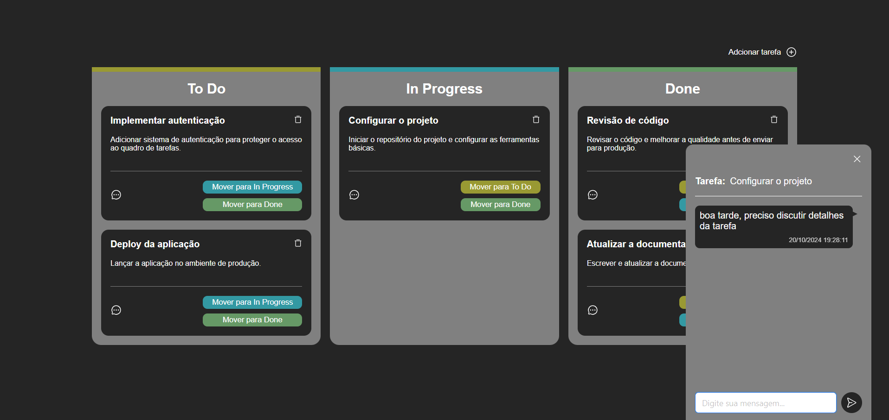

# Quadro de Tarefas

Este projeto é um **quadro de tarefas** onde é possível adicionar novas tarefas, mudar seus status e abrir um chat para cada tarefa. A aplicação é desenvolvida em **React** e utiliza uma **API mockada** para simular a persistência de dados.

## Funcionalidades

- **Adicionar tarefas**: É possível criar novas tarefas fornecendo título, descrição e status (Pendente, Em andamento, Concluída).
- **Mudar status da tarefa**: Cada tarefa pode ter seu status alterado de "Pendente" para "Em andamento" ou "Concluída".
- **Abrir chat**: Cada tarefa tem um chat associado onde os usuários podem enviar mensagens relacionadas a ela.

## Tecnologias Utilizadas

- **React**: Para construção da interface.
- **React Hook Form**: Para gerenciar o estado do formulário de criação e edição de tarefas.
- **Ant Design**: Para componentes de interface como inputs, modais e botões.
- **Axios**: Para realizar requisições à API.
- **JSON Server**: API mockada utilizando JSON para simular a persistência de dados.

## Como Rodar o Projeto

### Requisitos

- Node.js (preferencialmente versão 14 ou superior)

